# DirectX Game Framework - アーキテクチャドキュメント

## 1. フレームワーク概要

本フレームワークは、DirectX11を用いた3Dゲーム開発のための基盤システムです。
コンポーネントベースアーキテクチャ、シーン管理、物理演算、リソース管理を統合しています。

---

## 2. 全体アーキテクチャ図

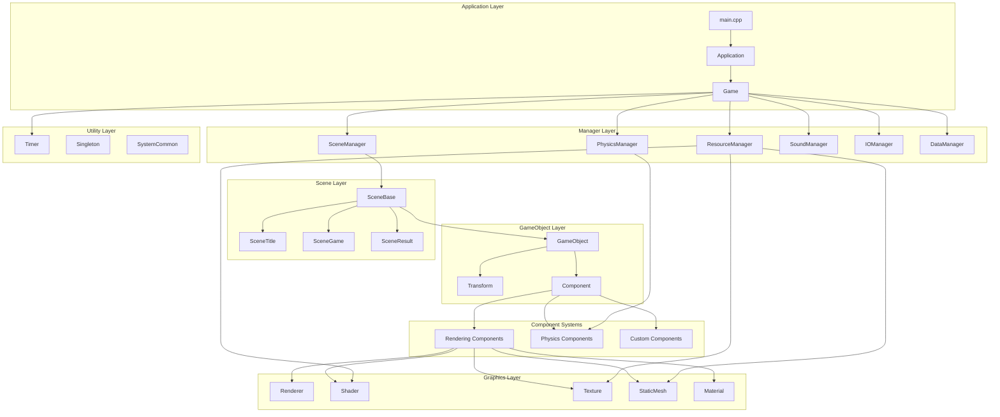

---

## 3. 主要クラス図

### 3.1 コアシステム

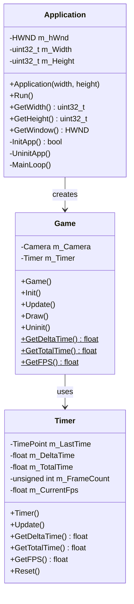

### 3.2 マネージャー層

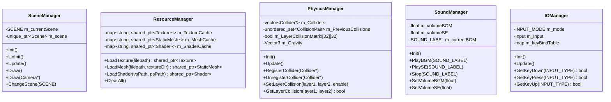

### 3.3 GameObjectシステム

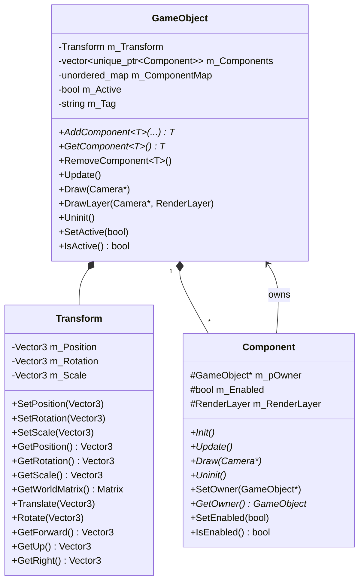

### 3.4 コンポーネントシステム

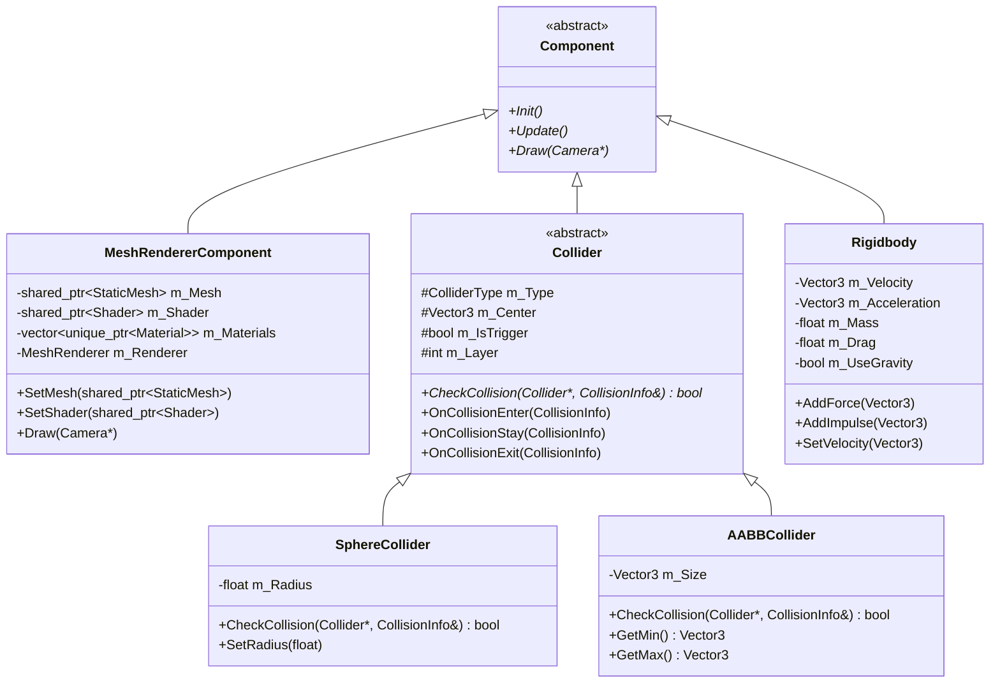

### 3.5 グラフィックスシステム

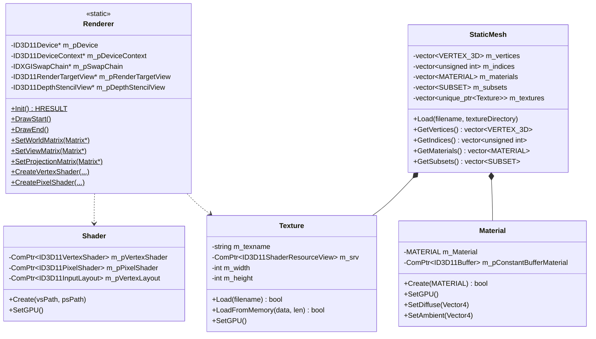

### 3.6 シーンシステム

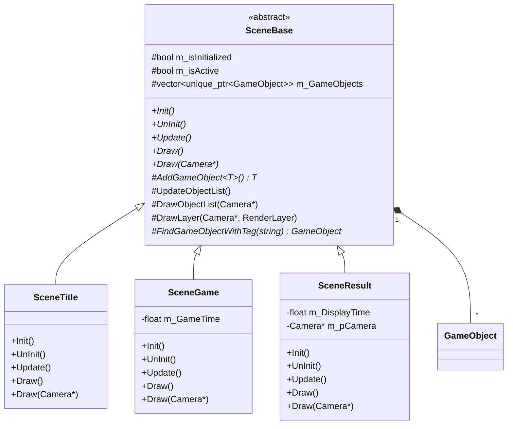

---

## 4. システムフロー図

### 4.1 アプリケーション初期化フロー

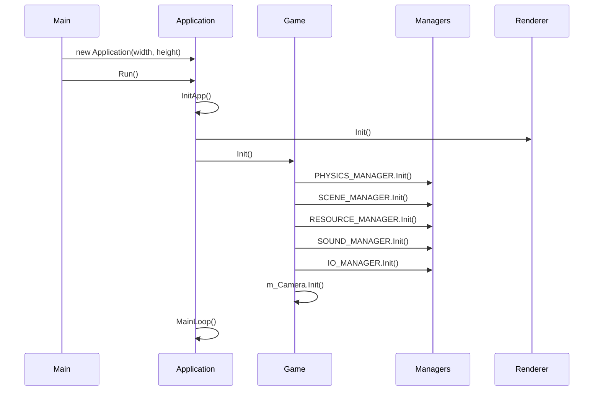

### 4.2 メインループフロー

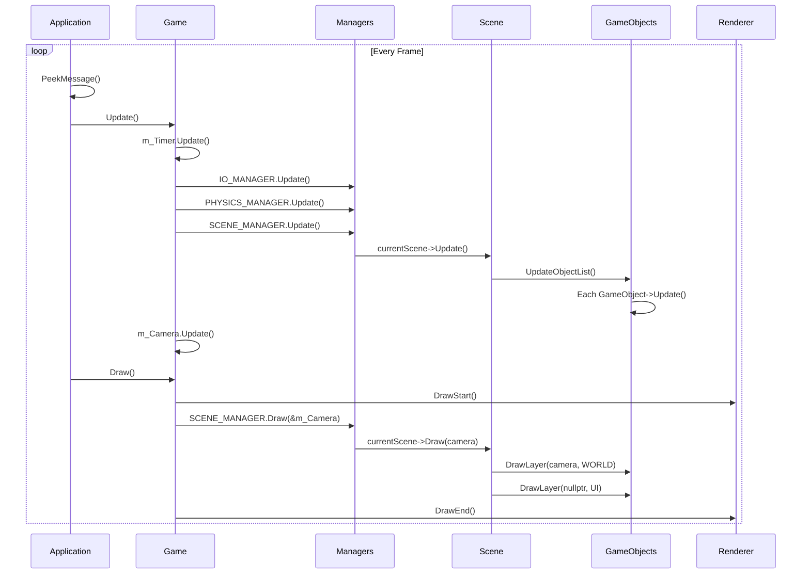

### 4.3 物理演算フロー

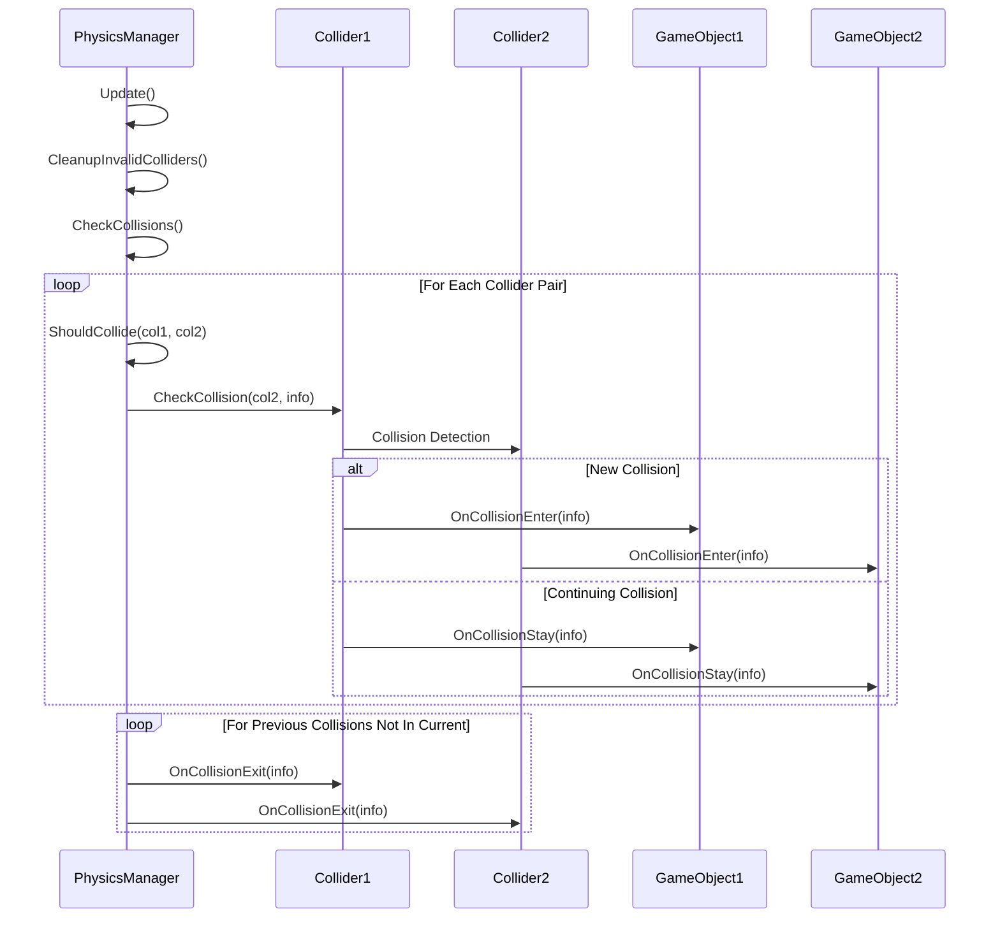

### 4.4 リソース管理フロー

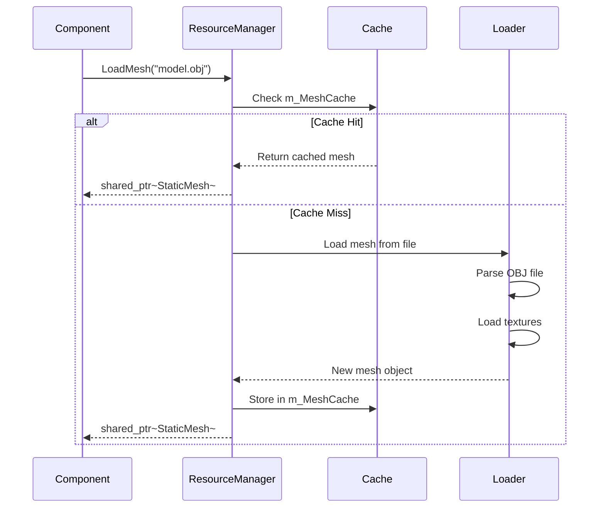

---

## 5. データフロー図

### 5.1 入力システムデータフロー

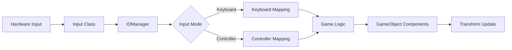

### 5.2 描画パイプライン

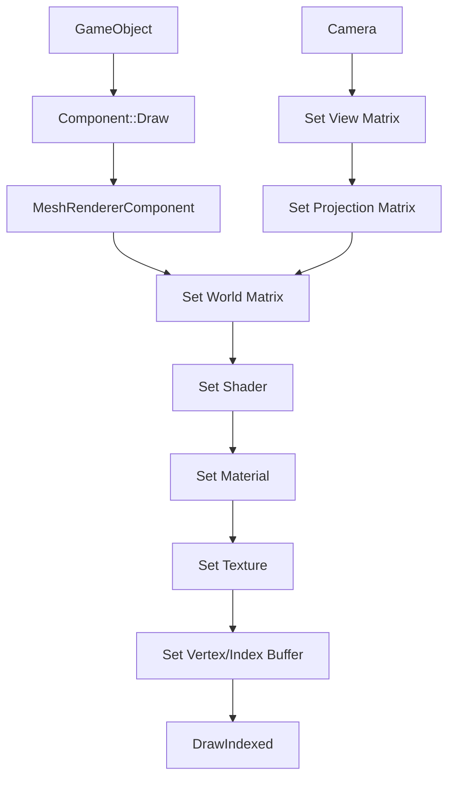

---

## 6. メモリ管理図

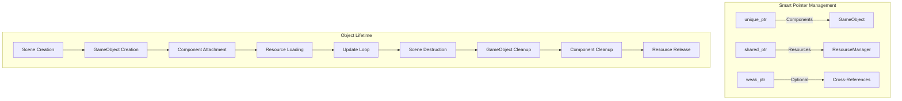

---

## 7. ディレクトリ構造

```
Project/
├── Core/
│   ├── Application.h/cpp      # ウィンドウ・メインループ管理
│   └── Game.h/cpp             # ゲームメインクラス
│
├── Manager/
│   ├── SceneManager.h/cpp     # シーン管理
│   ├── ResourceManager.h/cpp  # リソースキャッシュ管理
│   ├── PhysicsManager.h/cpp   # 物理演算・衝突判定管理
│   ├── SoundManager.h/cpp     # サウンド管理
│   ├── IOManager.h/cpp        # 入力管理
│   └── DataManager.h/cpp      # データ管理
│
├── GameObject/
│   ├── GameObject.h           # ゲームオブジェクト基底
│   ├── Transform.h            # 座標変換
│   ├── Component.h            # コンポーネント基底
│   ├── MeshRendererComponent.h
│   ├── PhysicsComponent/
│   │   ├── Collider.h/cpp
│   │   ├── SphereCollider.h/cpp
│   │   ├── AABBCollider.h/cpp
│   │   └── Rigidbody.h/cpp
│   └── TestComponent/         # テスト用コンポーネント
│
├── Graphics/
│   ├── Renderer.h/cpp         # 描画システム
│   ├── Shader.h/cpp           # シェーダー管理
│   ├── Texture.h/cpp          # テクスチャ管理
│   ├── VertexBuffer.h
│   ├── IndexBuffer.h
│   └── assimp/                # 3Dモデル読み込み
│       ├── AssimpParse.h/cpp
│       ├── StaticMesh.h/cpp
│       ├── Material.h
│       └── MeshRenderer.h
│
├── Scene/
│   ├── SceneBase.h/cpp        # シーン基底クラス
│   ├── Scene.h                # シーン定義
│   └── TestScene/             # テストシーン
│       ├── SceneTitle.h/cpp
│       ├── SceneGame.h/cpp
│       └── SceneResult.h/cpp
│
├── System/
│   ├── Camera.h/cpp           # カメラシステム
│   ├── input.h/cpp            # 入力システム
│   └── sound.h/cpp            # サウンドシステム
│
├── Util/
│   ├── SystemCommon.h         # 共通型定義
│   ├── PhysicsCommon.h        # 物理演算共通定義
│   ├── Timer.h/cpp            # タイマー
│   └── singleton.h/cpp        # シングルトン実装
│
└── main.h/cpp                 # エントリーポイント
```

---

## 8. 設計パターン使用状況

| パターン | 使用箇所 | 目的 |
|---------|---------|------|
| **Singleton** | 各種Manager | グローバルアクセス可能な単一インスタンス |
| **Component** | GameObject | 機能の組み合わせによる柔軟な設計 |
| **Factory** | ResourceManager | リソースの統一的な生成・管理 |
| **Observer** | Collision System | 衝突イベントの通知 |
| **State** | SceneManager | シーン遷移の管理 |
| **Template Method** | SceneBase | 共通処理の定義と個別実装の分離 |

---

## 9. 主要データ構造

### 9.1 頂点データ

```cpp
struct VERTEX_3D {
    DirectX::SimpleMath::Vector3 position;
    DirectX::SimpleMath::Vector3 normal;
    DirectX::SimpleMath::Color color;
    DirectX::SimpleMath::Vector2 uv;
};
```

### 9.2 衝突情報

```cpp
struct CollisionInfo {
    GameObject* other;
    Collider* otherCollider;
    Vector3 contactPoint;
    Vector3 contactNormal;
    float penetrationDepth;
    Vector3 relativeVelocity;
    float timestamp;
};
```

### 9.3 マテリアル

```cpp
struct MATERIAL {
    DirectX::SimpleMath::Color Ambient;
    DirectX::SimpleMath::Color Diffuse;
    DirectX::SimpleMath::Color Specular;
    DirectX::SimpleMath::Color Emission;
    float Shiness;
    BOOL TextureEnable;
};
```

---

## 10. スレッドセーフティ

| システム | スレッドセーフ | 備考 |
|---------|--------------|------|
| Singleton初期化 | ✅ Yes | std::call_once使用 |
| ResourceManager | ❌ No | 単一スレッド前提 |
| PhysicsManager | ❌ No | 単一スレッド前提 |
| 入力システム | ❌ No | 単一スレッド前提 |

**注意**: 現在は単一スレッドでの動作を前提としています。マルチスレッド化する場合は各マネージャーにミューテックスの追加が必要です。

---

## 11. パフォーマンス考慮事項

### キャッシュ戦略
- **ResourceManager**: ファイルパスをキーとしたリソースキャッシュ
- **ComponentMap**: type_indexによる高速なコンポーネント検索

### メモリプール
- 現在は標準のnew/deleteを使用
- 頻繁に生成・破棄されるオブジェクトには今後メモリプールの導入を検討

### 描画最適化
- サブセット単位での描画
- マテリアル・テクスチャのバッチング余地あり

---

このアーキテクチャドキュメントは、フレームワークの現状を詳細に記述しています。
次のセクションで、詳細な評価と改善提案を行います。
