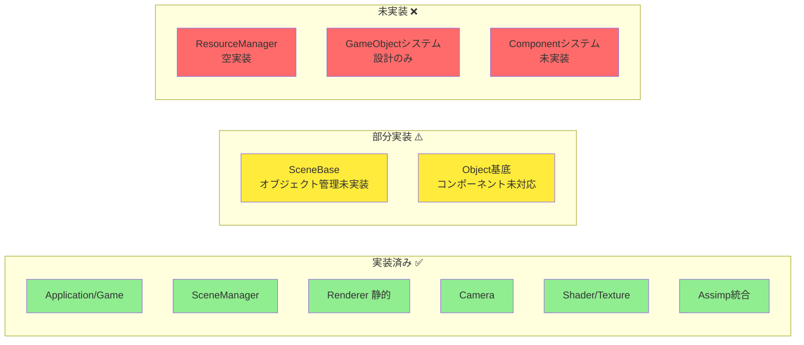
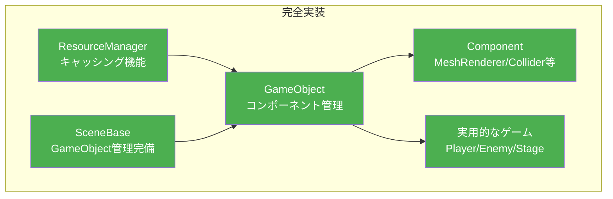
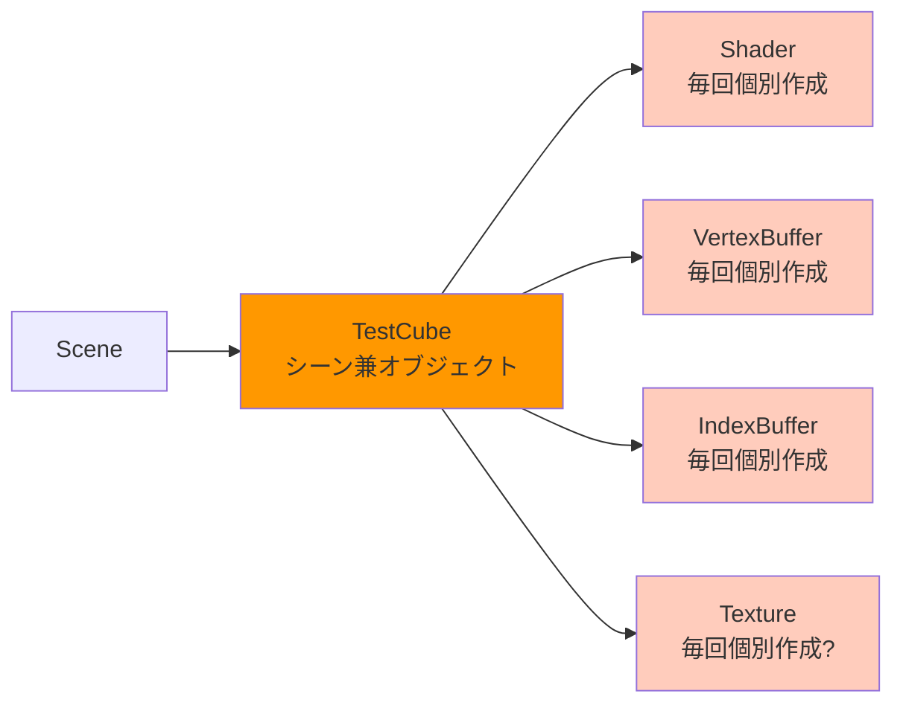
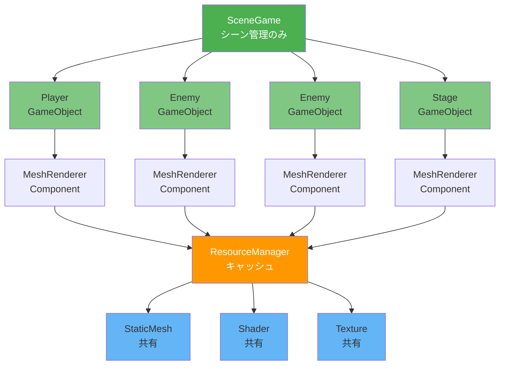
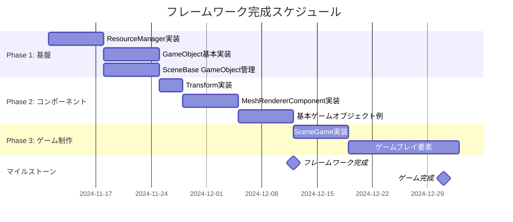

# フレームワーク進化図 - 現状 vs 理想

## 📊 現在の状態 (約60%完成)



**現在の問題点:**
- 🔴 ゲームオブジェクトを効率的に管理できない
- 🔴 リソースの重複読み込みが発生
- 🔴 シーンにオブジェクトを配置する仕組みがない
- 🔴 コンポーネントベースの設計が実現できていない

## 🎯 理想の状態 (100%完成目標)



**理想状態の特徴:**
- ✅ リソースを一元管理し、メモリ効率が良い
- ✅ GameObjectとComponentで柔軟に機能を組み合わせ可能
- ✅ シーンにオブジェクトを簡単に追加できる
- ✅ 実際のゲーム開発がスムーズに進む

---

## 🔄 データフロー比較

### 現在のデータフロー (複雑で管理困難)



**問題:**
- TestCube がシーンとオブジェクトを兼ねている
- リソースを毎回作成している可能性
- 拡張性がない

### 理想のデータフロー (明確で管理しやすい)



**利点:**
- シーンとオブジェクトが明確に分離
- ResourceManager が リソースをキャッシュ
- 同じモデルを複数のオブジェクトで共有可能
- メモリ効率が大幅に向上

---

## 🏗️ 実装ロードマップ (12月末まで)



---

## 📝 実装チェックリスト

### Week 1-2: Phase 1 基盤整備

- [ ] **ResourceManager 実装**
  - [ ] `LoadTexture()` - キャッシュ機能付き
  - [ ] `LoadMesh()` - キャッシュ機能付き
  - [ ] `LoadShader()` - キャッシュ機能付き
  - [ ] `ClearAll()` - リソース解放

- [ ] **GameObject 基本実装**
  - [ ] `AddComponent<T>()` - テンプレート関数
  - [ ] `GetComponent<T>()` - テンプレート関数
  - [ ] `Update()` - コンポーネント更新呼び出し
  - [ ] `Draw()` - コンポーネント描画呼び出し

- [ ] **Component 基底クラス**
  - [ ] `Init()` - 初期化
  - [ ] `Update()` - 更新
  - [ ] `Draw()` - 描画
  - [ ] `SetOwner()` / `GetOwner()` - オーナー設定

- [ ] **Transform 実装**
  - [ ] Position / Rotation / Scale
  - [ ] `GetWorldMatrix()` - ワールド行列計算

- [ ] **SceneBase 改良**
  - [ ] `AddGameObject<T>()` - GameObject追加
  - [ ] `UpdateObjectList()` - 全更新
  - [ ] `DrawObjectList()` - 全描画
  - [ ] `DeleteObjectList()` - 全削除

### Week 3-4: Phase 2 コンポーネント実装

- [ ] **MeshRendererComponent**
  - [ ] `SetMesh()` - モデル設定
  - [ ] `SetShader()` - シェーダー設定
  - [ ] `SetMaterials()` - マテリアル設定
  - [ ] `Draw()` - サブセット描画

- [ ] **基本ゲームオブジェクト**
  - [ ] `PlayerObject` クラス
  - [ ] `EnemyObject` クラス
  - [ ] `StageObject` クラス

- [ ] **動作確認用シーン**
  - [ ] SceneGame で複数オブジェクト配置
  - [ ] リソース共有の確認
  - [ ] パフォーマンス測定

### Week 5-7: Phase 3 ゲーム制作

- [ ] **ゲームロジック**
  - [ ] プレイヤー操作
  - [ ] 敵AI (簡易)
  - [ ] 衝突判定 (簡易)

- [ ] **シーン追加**
  - [ ] タイトルシーン完成
  - [ ] ゲームシーン完成
  - [ ] リザルトシーン作成

---

## 💡 重要なポイント

### 1. ResourceManager は最優先

```cpp
// ❌ 悪い例: 毎回読み込み
auto texture1 = std::make_unique<Texture>();
texture1->Load("model/player.png");

auto texture2 = std::make_unique<Texture>();
texture2->Load("model/player.png");  // 同じファイルを2回読込！

// ✅ 良い例: キャッシュ活用
auto texture1 = M_RESOURCE.LoadTexture("model/player.png");
auto texture2 = M_RESOURCE.LoadTexture("model/player.png"); // キャッシュから取得
```

### 2. GameObject と Component の分離

```cpp
// ❌ 悪い例: すべてを継承で実装
class Player : public Object {
    Shader m_Shader;
    VertexBuffer m_VB;
    // ... 描画関連の実装がごちゃまぜ
};

// ✅ 良い例: コンポーネントで機能分離
auto player = AddGameObject<GameObject>();
player->AddComponent<MeshRendererComponent>();
player->AddComponent<PlayerController>();  // 動き
player->AddComponent<ColliderComponent>(); // 衝突
```

### 3. Scene は管理に専念

```cpp
// ❌ 悪い例: Scene が GameObject を兼ねる
class TestCube : public SceneBase {
    // シーン処理 + 描画処理が混在
};

// ✅ 良い例: Scene は GameObject を管理するだけ
class SceneGame : public SceneBase {
    void Init() {
        auto cube = AddGameObject<GameObject>();
        // オブジェクトを追加するだけ
    }
};
```

---

## 🎓 学習リソース

実装の参考になる情報:

1. **Unityのドキュメント** - Component システムの理解
2. **DirectX サンプル** - 描画最適化
3. **Game Programming Patterns** - デザインパターン

---

## ✅ 完成イメージ

最終的には、このようなコードでゲームを作れるようになります:

```cpp
void SceneGame::Init() {
    // プレイヤー作成
    auto player = AddGameObject<GameObject>();
    player->GetTransform().SetPosition(Vector3(0, 0, 0));
    player->GetTransform().SetScale(Vector3(2, 2, 2));
    
    auto playerRenderer = player->AddComponent<MeshRendererComponent>();
    playerRenderer->SetMesh(M_RESOURCE.LoadMesh("model/player.obj"));
    playerRenderer->SetShader(M_RESOURCE.LoadShader("shader/lit.vs", "shader/lit.ps"));
    
    auto playerController = player->AddComponent<PlayerController>();
    
    // 敵を10体作成 (リソースは共有される!)
    for (int i = 0; i < 10; i++) {
        auto enemy = AddGameObject<GameObject>();
        enemy->GetTransform().SetPosition(Vector3(i * 5, 0, 20));
        
        auto enemyRenderer = enemy->AddComponent<MeshRendererComponent>();
        enemyRenderer->SetMesh(M_RESOURCE.LoadMesh("model/enemy.obj"));  // 共有!
        enemyRenderer->SetShader(M_RESOURCE.LoadShader("shader/lit.vs", "shader/lit.ps"));  // 共有!
        
        enemy->AddComponent<EnemyAI>();
    }
    
    // ステージ作成
    auto stage = AddGameObject<GameObject>();
    stage->GetTransform().SetScale(Vector3(10, 1, 10));
    
    auto stageRenderer = stage->AddComponent<MeshRendererComponent>();
    stageRenderer->SetMesh(M_RESOURCE.LoadMesh("model/stage.obj"));
    stageRenderer->SetShader(M_RESOURCE.LoadShader("shader/lit.vs", "shader/lit.ps"));
    
    m_isInitialized = true;
}
```

**このコードの素晴らしい点:**
- 🎯 **直感的**: オブジェクトを追加するだけ
- 🚀 **効率的**: リソースは自動でキャッシュされる
- 🔧 **拡張可能**: 新しいコンポーネントを追加できる
- 📝 **保守しやすい**: 各クラスの役割が明確

---

## 📈 期待される効果

| 項目 | 現在 | 理想 |
|------|------|------|
| **開発効率** | ⭐⭐ | ⭐⭐⭐⭐⭐ |
| **メモリ効率** | ⭐⭐ | ⭐⭐⭐⭐⭐ |
| **拡張性** | ⭐⭐ | ⭐⭐⭐⭐⭐ |
| **保守性** | ⭐⭐⭐ | ⭐⭐⭐⭐⭐ |
| **チーム開発しやすさ** | ⭐⭐ | ⭐⭐⭐⭐⭐ |

このフレームワークを完成させれば、**チーム全員が効率的にゲーム開発できる環境**が整います! 🎮✨
