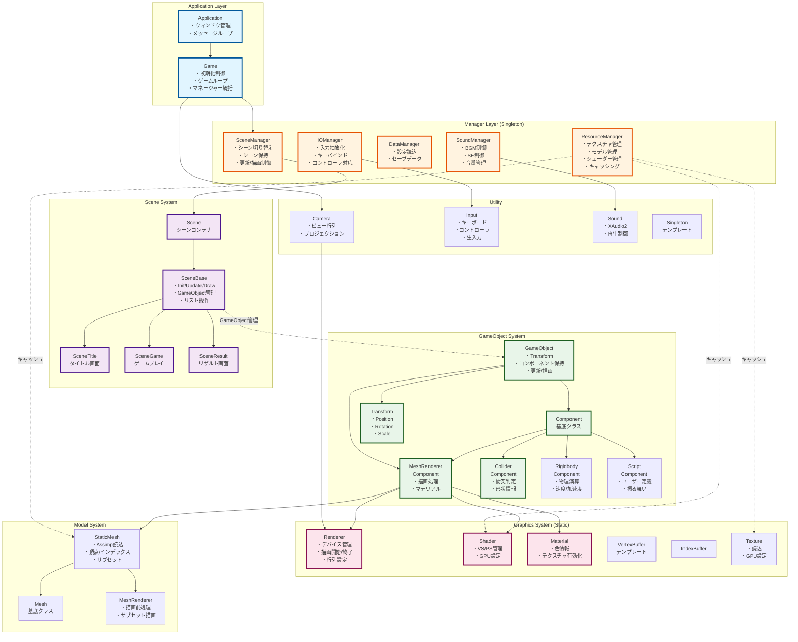

# DirectX11 ゲームフレームワーク - 最終設計書

## 全体アーキテクチャ図



## クラス責任詳細

### 1. Manager Layer

#### ResourceManager (最重要・実装必須)

```cpp
class ResourceManager {
private:
    // キャッシュマップ
    std::unordered_map<std::string, std::shared_ptr<Texture>> m_Textures;
    std::unordered_map<std::string, std::shared_ptr<StaticMesh>> m_Meshes;
    std::unordered_map<std::string, std::shared_ptr<Shader>> m_Shaders;
    
public:
    // テクスチャ取得（キャッシュ活用）
    std::shared_ptr<Texture> LoadTexture(const std::string& path);
    
    // モデル取得（キャッシュ活用）
    std::shared_ptr<StaticMesh> LoadMesh(const std::string& path);
    
    // シェーダー取得（キャッシュ活用）
    std::shared_ptr<Shader> LoadShader(const std::string& vs, const std::string& ps);
    
    // リソース解放
    void ClearAll();
};
```

**役割:**
- リソースの一元管理
- 重複読み込み防止（パフォーマンス向上）
- 参照カウントによる自動解放

### 2. GameObject System

#### GameObject クラス

```cpp
class GameObject {
protected:
    Transform m_Transform;
    std::vector<std::unique_ptr<Component>> m_Components;
    bool m_Active = true;
    std::string m_Tag;
    
public:
    // コンポーネント追加
    template<typename T, typename... Args>
    T* AddComponent(Args&&... args);
    
    // コンポーネント取得
    template<typename T>
    T* GetComponent();
    
    // 更新
    virtual void Update();
    
    // 描画
    virtual void Draw(Camera* camera);
    
    // Transform アクセス
    Transform& GetTransform() { return m_Transform; }
};
```

#### Component 基底クラス

```cpp
class Component {
protected:
    GameObject* m_pOwner = nullptr;
    bool m_Enabled = true;
    
public:
    virtual void Init() {}
    virtual void Update() {}
    virtual void Draw(Camera* camera) {}
    
    void SetOwner(GameObject* owner) { m_pOwner = owner; }
    GameObject* GetOwner() { return m_pOwner; }
};
```

#### MeshRendererComponent 実装例

```cpp
class MeshRendererComponent : public Component {
private:
    std::shared_ptr<StaticMesh> m_Mesh;
    std::shared_ptr<Shader> m_Shader;
    std::vector<std::shared_ptr<Material>> m_Materials;
    MeshRenderer m_Renderer;
    
public:
    void SetMesh(std::shared_ptr<StaticMesh> mesh);
    void SetShader(std::shared_ptr<Shader> shader);
    
    void Draw(Camera* camera) override {
        if (!m_Mesh || !m_Shader) return;
        
        // Transform取得
        Matrix worldMatrix = m_pOwner->GetTransform().GetWorldMatrix();
        
        // 描画設定
        Renderer::SetWorldMatrix(&worldMatrix);
        m_Shader->SetGPU();
        
        // サブセットごとに描画
        m_Renderer.BeforeDraw();
        for (const auto& subset : m_Mesh->GetSubsets()) {
            m_Materials[subset.MaterialIdx]->SetGPU();
            m_Renderer.DrawSubset(subset.IndexNum, subset.IndexBase, subset.VertexBase);
        }
    }
};
```

### 3. Scene System の改善

#### SceneBase の GameObject 管理

```cpp
class SceneBase {
protected:
    std::vector<std::unique_ptr<GameObject>> m_GameObjects;
    bool m_isInitialized = false;
    
public:
    // GameObject追加
    template<typename T>
    T* AddGameObject() {
        auto obj = std::make_unique<T>();
        T* ptr = obj.get();
        m_GameObjects.push_back(std::move(obj));
        return ptr;
    }
    
    // 全オブジェクト更新
    void UpdateObjectList() {
        for (auto& obj : m_GameObjects) {
            if (obj->IsActive()) {
                obj->Update();
            }
        }
    }
    
    // 全オブジェクト描画
    void DrawObjectList(Camera* camera) {
        for (auto& obj : m_GameObjects) {
            if (obj->IsActive()) {
                obj->Draw(camera);
            }
        }
    }
    
    // クリア
    void DeleteObjectList() {
        m_GameObjects.clear();
    }
};
```

## 実装優先順位（12月末まで）

### 🔴 Phase 1: 基盤整備 (2週間)

1. **ResourceManager 実装**
   - テクスチャキャッシュ
   - モデルキャッシュ
   - シェーダーキャッシュ

2. **GameObject 基本実装**
   - GameObject クラス
   - Component 基底クラス
   - Transform コンポーネント

3. **SceneBase の GameObject 管理**
   - AddGameObject 実装
   - UpdateObjectList 実装
   - DrawObjectList 実装

### 🟡 Phase 2: コンポーネント実装 (2週間)

4. **MeshRendererComponent**
   - StaticMesh 統合
   - Material 連携
   - サブセット描画

5. **基本的なゲームオブジェクト例**
   - Player クラス
   - Enemy クラス
   - Stage クラス

### 🟢 Phase 3: ゲームロジック (残り期間)

6. **Collider/Rigidbody (オプション)**
   - 必要に応じて実装
   - 簡易的な衝突判定

7. **実際のゲーム制作**
   - SceneGame 実装
   - ゲームプレイ要素

## 使用例

### ゲームオブジェクトの作成

```cpp
void SceneGame::Init() {
    // Playerオブジェクト作成
    auto* player = AddGameObject<GameObject>();
    player->GetTransform().SetPosition(Vector3(0, 0, 0));
    
    // MeshRenderer追加
    auto* renderer = player->AddComponent<MeshRendererComponent>();
    renderer->SetMesh(M_RESOURCE.LoadMesh("model/player.obj"));
    renderer->SetShader(M_RESOURCE.LoadShader("shader/lit.vs", "shader/lit.ps"));
    
    // Script追加（ユーザー定義の動き）
    player->AddComponent<PlayerController>();
    
    m_isInitialized = true;
}
```

## まとめ

この設計により:
- ✅ **Manager による統合管理**: リソース、シーン、サウンド、入力を一元管理
- ✅ **Component ベース**: 柔軟なゲームオブジェクト設計
- ✅ **拡張性**: 新しいコンポーネントを追加しやすい
- ✅ **保守性**: 責任分離により各クラスが独立
- ✅ **パフォーマンス**: ResourceManager によるキャッシング

12月末までに **Phase 1 と Phase 2** を完成させれば、実用的なフレームワークになります!
