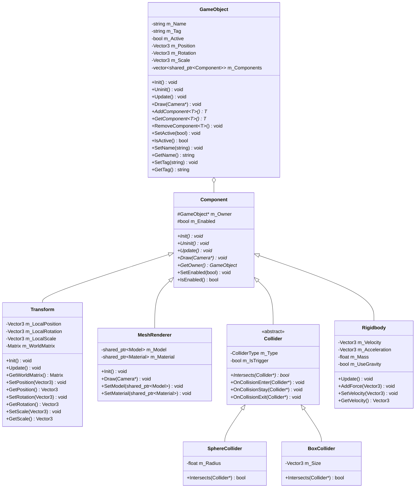

# DirectX ゲームフレームワーク 最終設計図

## 1. 全体構成図

## 2. コアシステム クラス図

## 3. シーン管理システム クラス図

## 4. GameObjectシステム クラス図

## 5. グラフィックスシステム クラス図

## 6. エフェクトシステム クラス図

## 7. リソース管理システム クラス図

## 8. 物理・衝突判定システム クラス図

## 9. UIシステム クラス図

## 10. 入力システム クラス図

## 11. サウンドシステム クラス図

## 12. ユーティリティクラス図

## 13. システム依存関係図

