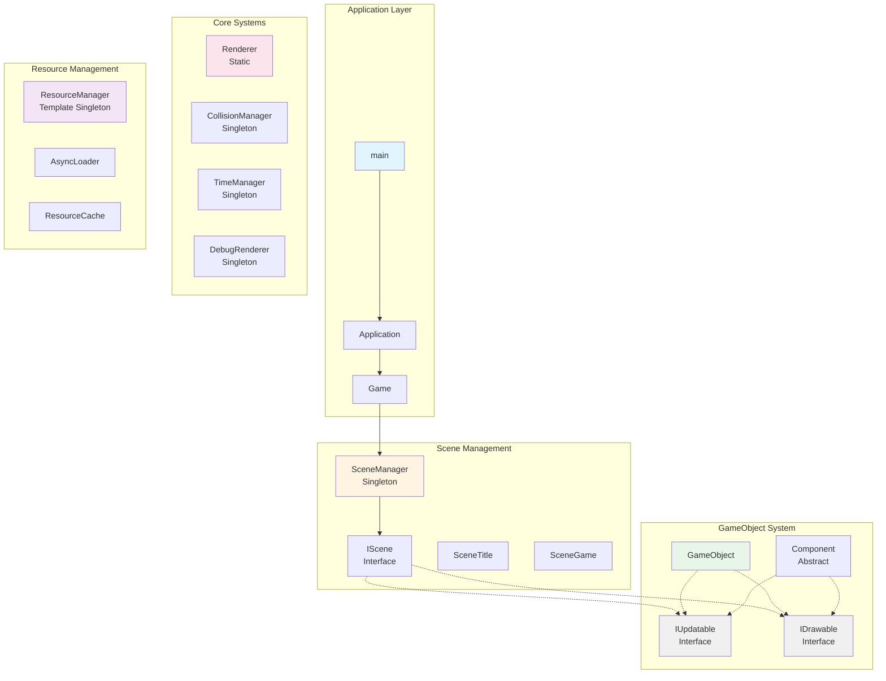
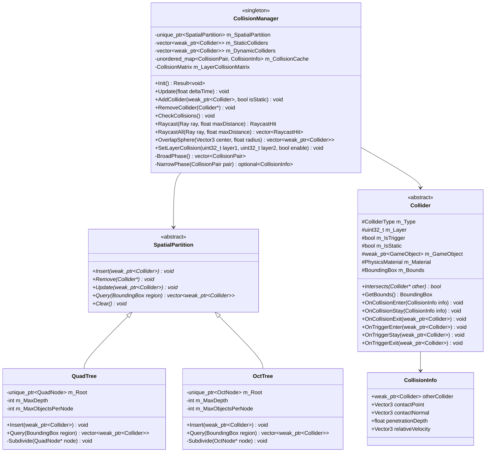
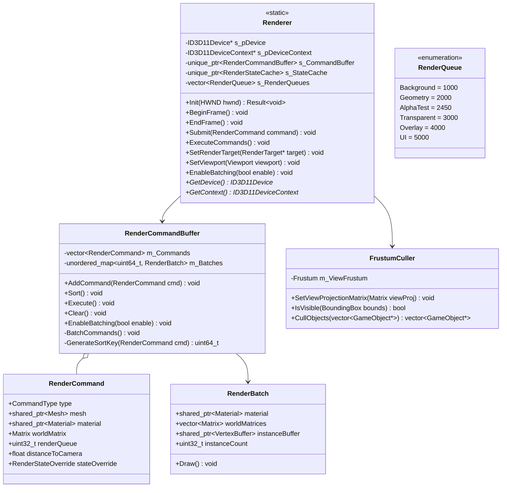
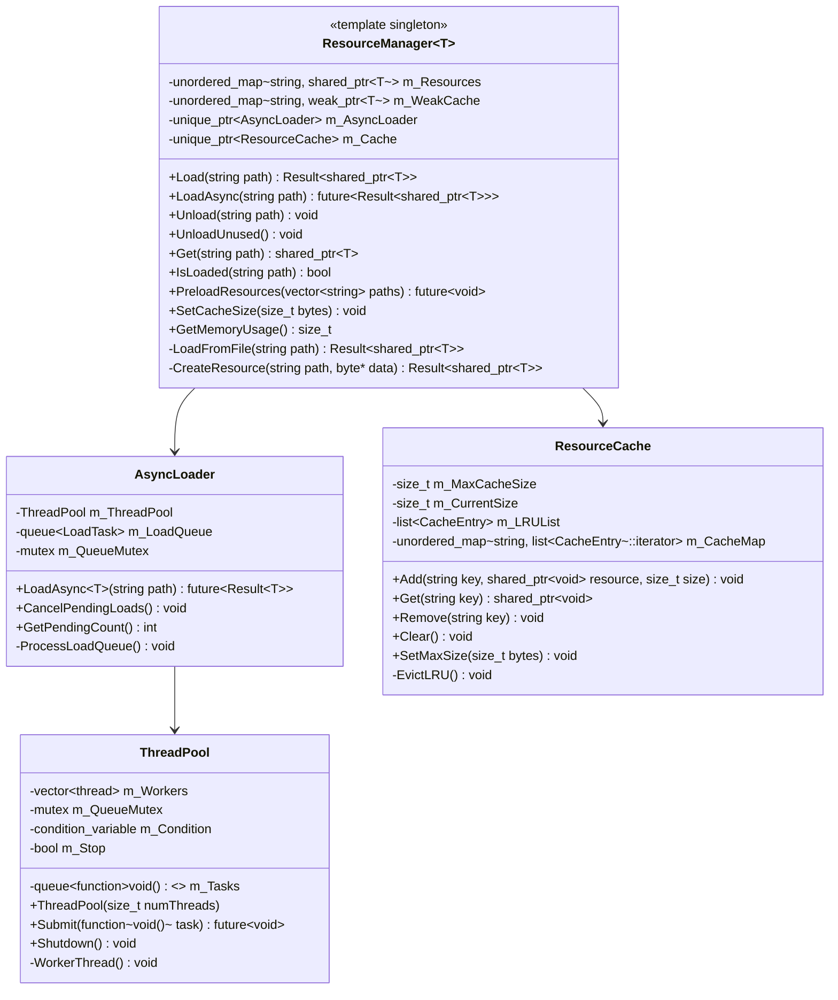
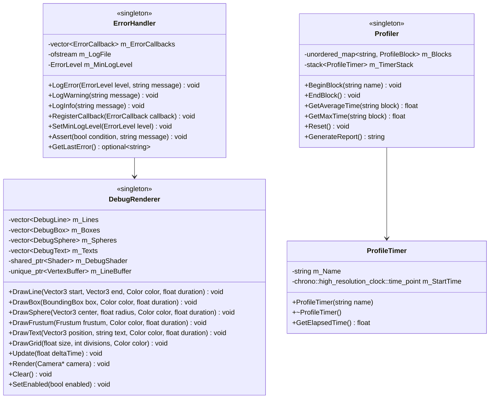
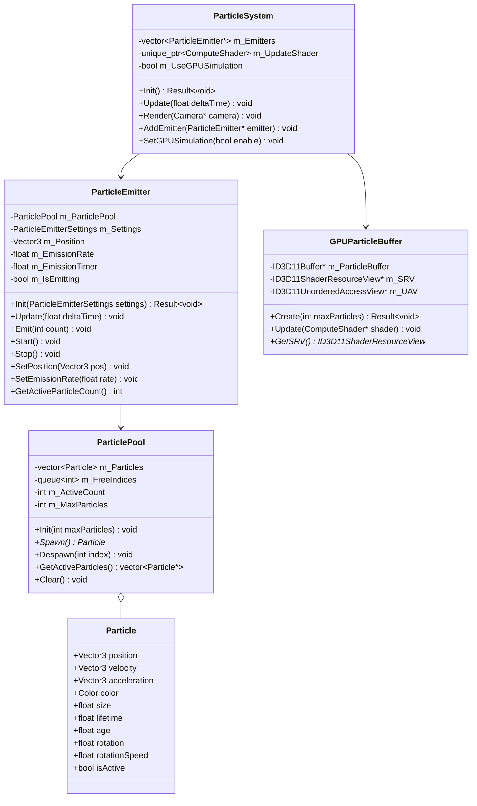
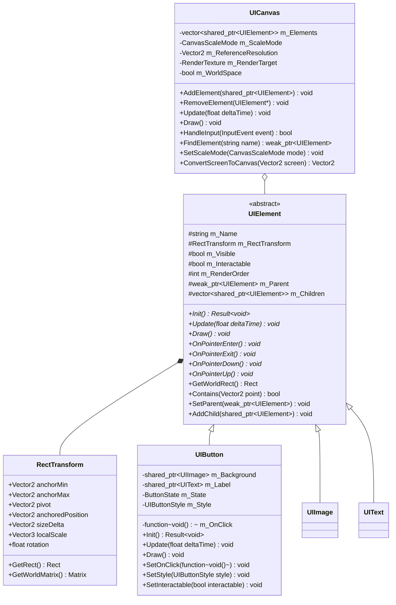
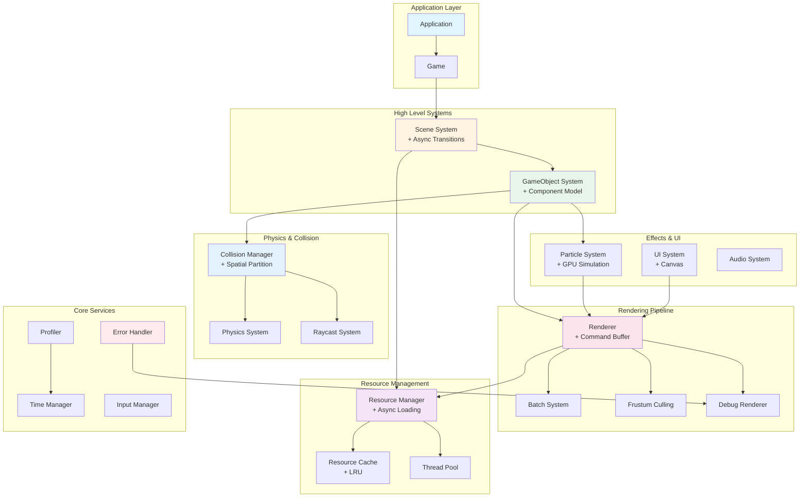
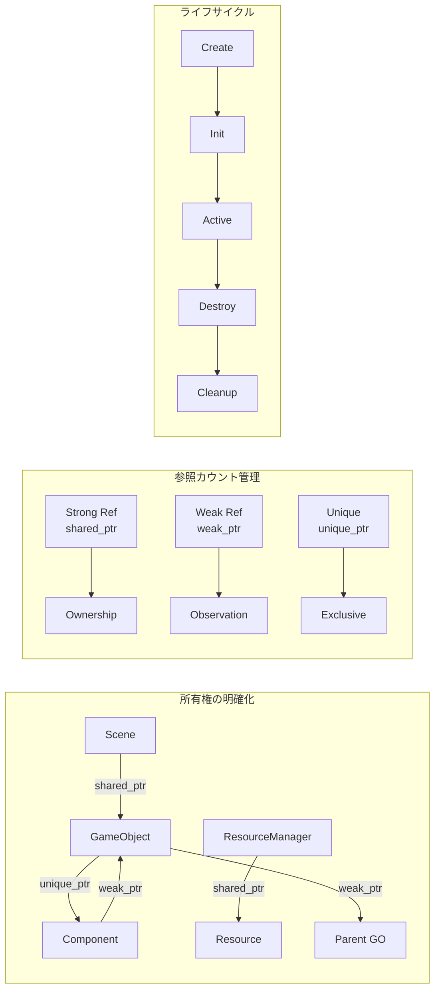

# DirectX ゲームフレームワーク 改善版設計図

## 1. 全体アーキテクチャ概要



## 2. コアシステム・インターフェース設計

```mermaid
classDiagram
    class IUpdatable {
        <<interface>>
        +Update(float deltaTime) void*
        +IsActive() bool*
    }
    
    class IDrawable {
        <<interface>>
        +Draw(Camera* camera) void*
        +IsVisible() bool*
        +GetRenderPriority() int*
    }
    
    class IScene {
        <<interface>>
        +Init() Result~void~*
        +Uninit() void*
        +Update(float deltaTime) void*
        +Draw() void*
        +OnEnter() void*
        +OnExit() void*
        +OnPause() void*
        +OnResume() void*
    }
    
    class Result~T~ {
        -optional~T~ m_value
        -string m_error
        +IsSuccess() bool
        +GetValue() T&
        +GetError() string
        +Success(T value) Result~T~$
        +Error(string error) Result~T~$
    }
    
    class Application {
        -HINSTANCE m_hInst
        -HWND m_hWnd
        -uint32_t m_Width
        -uint32_t m_Height
        -unique_ptr~Game~ m_Game
        +Application(width, height)
        +Run() Result~void~
        +GetWindow() HWND
        -InitApp() Result~void~
        -UninitApp() void
        -MainLoop() void
        -WndProc() LRESULT
    }
    
    class Game {
        -unique_ptr~Camera~ m_MainCamera
        -unique_ptr~DebugRenderer~ m_DebugRenderer
        +Init() Result~void~
        +Update(float deltaTime) void
        +Draw() void
        +Uninit() void
        +GetMainCamera() Camera*
    }
    
    Application --> Game
    Application ..> Result
    Game -.-> IUpdatable
    Game -.-> IDrawable
```

## 3. メモリ管理統一版 GameObject システム

```mermaid
classDiagram
    class GameObject {
        -string m_Name
        -string m_Tag
        -uint32_t m_Layer
        -bool m_Active
        -unique_ptr~Transform~ m_Transform
        -vector~unique_ptr~Component~~ m_Components
        -weak_ptr~GameObject~ m_Parent
        -vector~shared_ptr~GameObject~~ m_Children
        +Init() Result~void~
        +Uninit() void
        +Update(float deltaTime) void
        +Draw(Camera* camera) void
        +LateUpdate(float deltaTime) void
        +FixedUpdate(float fixedDeltaTime) void
        +AddComponent~T~() Result~T*~
        +GetComponent~T~() T*
        +RemoveComponent~T~() void
        +GetTransform() Transform*
        +SetParent(weak_ptr~GameObject~) void
        +AddChild(shared_ptr~GameObject~) void
        +FindChild(string name) shared_ptr~GameObject~
    }
    
    class Transform {
        -Vector3 m_LocalPosition
        -Quaternion m_LocalRotation
        -Vector3 m_LocalScale
        -Matrix m_WorldMatrix
        -bool m_IsDirty
        +UpdateWorldMatrix() void
        +GetWorldMatrix() Matrix
        +SetLocalPosition(Vector3) void
        +GetWorldPosition() Vector3
        +TransformPoint(Vector3) Vector3
        +InverseTransformPoint(Vector3) Vector3
    }
    
    class Component {
        <<abstract>>
        #weak_ptr~GameObject~ m_Owner
        #bool m_Enabled
        +Init() Result~void~*
        +Uninit() void*
        +Update(float deltaTime) void*
        +LateUpdate(float deltaTime) void*
        +FixedUpdate(float fixedDeltaTime) void*
        +Draw(Camera* camera) void*
        +OnEnable() void*
        +OnDisable() void*
        +GetOwner() GameObject*
        +GetTransform() Transform*
        +SetEnabled(bool) void
        +IsEnabled() bool
    }
    
    class MeshRenderer {
        -shared_ptr~Model~ m_Model
        -shared_ptr~Material~ m_Material
        -bool m_CastShadows
        -bool m_ReceiveShadows
        +Init() Result~void~
        +Draw(Camera* camera) void
        +SetModel(shared_ptr~Model~) void
        +SetMaterial(shared_ptr~Material~) void
        +GetBounds() BoundingBox
    }
    
    GameObject -.-> IUpdatable
    GameObject -.-> IDrawable
    GameObject *-- Transform
    GameObject o-- Component
    Component -.-> IUpdatable
    Component -.-> IDrawable
    Component <|-- MeshRenderer
```

## 4. 改善版シーン管理システム

```mermaid
classDiagram
    class SceneManager {
        <<singleton>>
        -unique_ptr~SceneBase~ m_CurrentScene
        -unique_ptr~SceneBase~ m_NextScene
        -unique_ptr~SceneBase~ m_LoadingScene
        -bool m_IsTransitioning
        -float m_TransitionProgress
        -SceneTransition m_TransitionType
        +Init() Result~void~
        +Update(float deltaTime) void
        +Draw() void
        +ChangeScene~T~(SceneTransition type) Result~void~
        +ChangeSceneAsync~T~() future~Result~void~~
        +PushScene~T~() void
        +PopScene() void
        +GetCurrentScene() SceneBase*
        -HandleTransition() void
    }
    
    class SceneBase {
        <<abstract>>
        #bool m_IsInitialized
        #bool m_IsActive
        #bool m_IsPaused
        #vector~shared_ptr~GameObject~~ m_GameObjects
        #vector~shared_ptr~GameObject~~ m_UIObjects
        #unique_ptr~Camera~ m_SceneCamera
        #unique_ptr~UICanvas~ m_UICanvas
        #unordered_map~string, shared_ptr~GameObject~~ m_NamedObjects
        +Init() Result~void~*
        +Uninit() void*
        +Update(float deltaTime) void*
        +Draw() void*
        +OnEnter() void*
        +OnExit() void*
        +OnPause() void*
        +OnResume() void*
        +CreateGameObject(string name) shared_ptr~GameObject~
        +FindGameObject(string name) weak_ptr~GameObject~
        +FindGameObjectsWithTag(string tag) vector~weak_ptr~GameObject~~
        +DestroyGameObject(shared_ptr~GameObject~) void
        +PreloadResources() future~void~*
    }
    
    class SceneTransition {
        <<enumeration>>
        None
        Fade
        Slide
        Zoom
        Custom
    }
    
    SceneManager --> SceneBase
    SceneBase -.-> IScene
    SceneManager --> SceneTransition
```

## 5. 最適化版コリジョンシステム



## 6. レンダリング最適化システム



## 7. 非同期リソース管理システム



## 8. エラーハンドリング・デバッグシステム



## 9. 改善版パーティクルシステム



## 10. 改善版UIシステム



## 11. 統合システム依存関係図



## 12. メモリ管理ガイドライン



## 13. エラーハンドリングパターン

```cpp
// Result型を使用した統一的なエラーハンドリング
template<typename T>
class Result {
public:
    static Result<T> Success(T value) {
        Result<T> result;
        result.m_value = std::move(value);
        return result;
    }
    
    static Result<T> Error(std::string error) {
        Result<T> result;
        result.m_error = std::move(error);
        return result;
    }
    
    bool IsSuccess() const { return m_value.has_value(); }
    T& GetValue() { return m_value.value(); }
    const std::string& GetError() const { return m_error; }
    
private:
    std::optional<T> m_value;
    std::string m_error;
};

// 使用例
Result<std::shared_ptr<Model>> LoadModel(const std::string& path) {
    if (!FileExists(path)) {
        return Result<std::shared_ptr<Model>>::Error("File not found: " + path);
    }
    
    auto model = std::make_shared<Model>();
    if (!model->Load(path)) {
        return Result<std::shared_ptr<Model>>::Error("Failed to parse model: " + path);
    }
    
    return Result<std::shared_ptr<Model>>::Success(model);
}

// 呼び出し側
auto result = LoadModel("assets/model.fbx");
if (result.IsSuccess()) {
    auto model = result.GetValue();
    // モデルを使用
} else {
    ErrorHandler::LogError(ErrorLevel::Warning, result.GetError());
    // フォールバック処理
}
```

## 14. パフォーマンス最適化チェックリスト

### レンダリング最適化
- ✅ フラスタムカリング実装
- ✅ マテリアル/シェーダーごとのバッチング
- ✅ インスタンシング対応
- ✅ LOD（Level of Detail）システム
- ✅ オクルージョンカリング（オプション）

### メモリ最適化
- ✅ オブジェクトプール使用
- ✅ リソースキャッシュ with LRU
- ✅ 弱参照による循環参照防止
- ✅ 非同期リソースローディング

### CPU最適化
- ✅ 空間分割によるコリジョン高速化
- ✅ マルチスレッド対応
- ✅ コンポーネントのアップデート順序最適化
- ✅ デルタタイム管理

### GPU最適化
- ✅ GPUパーティクルシミュレーション
- ✅ Compute Shader活用
- ✅ ConstantBuffer最適化
- ✅ RenderState キャッシング

## 15. 実装優先順位

### Phase 1: 基盤構築（必須）
1. **Result型とエラーハンドリング**
2. **メモリ管理の統一（smart pointer）**
3. **基本的なGameObject/Componentシステム**
4. **シンプルなレンダラー**

### Phase 2: コア機能（重要）
5. **シーン管理システム**
6. **リソースマネージャー（同期版）**
7. **基本的なコリジョンシステム**
8. **入力管理**

### Phase 3: 最適化（推奨）
9. **レンダリングコマンドバッファ**
10. **空間分割（QuadTree/OctTree）**
11. **非同期リソースローディング**
12. **バッチングシステム**

### Phase 4: 高度な機能（オプション）
13. **GPUパーティクル**
14. **高度なUIシステム**
15. **プロファイラー**
16. **デバッグレンダラー**

## まとめ

この改善版設計では以下の点を重視しています：

1. **堅牢性**: Result型による統一的なエラーハンドリング
2. **パフォーマンス**: 空間分割、バッチング、非同期処理
3. **保守性**: インターフェース分離、単一責任原則
4. **拡張性**: テンプレート活用、プラグイン可能な設計
5. **デバッグ性**: 包括的なデバッグツール、プロファイリング

実装時は Phase 1 から順に進めることで、安定した基盤の上に機能を積み上げていくことができます。
