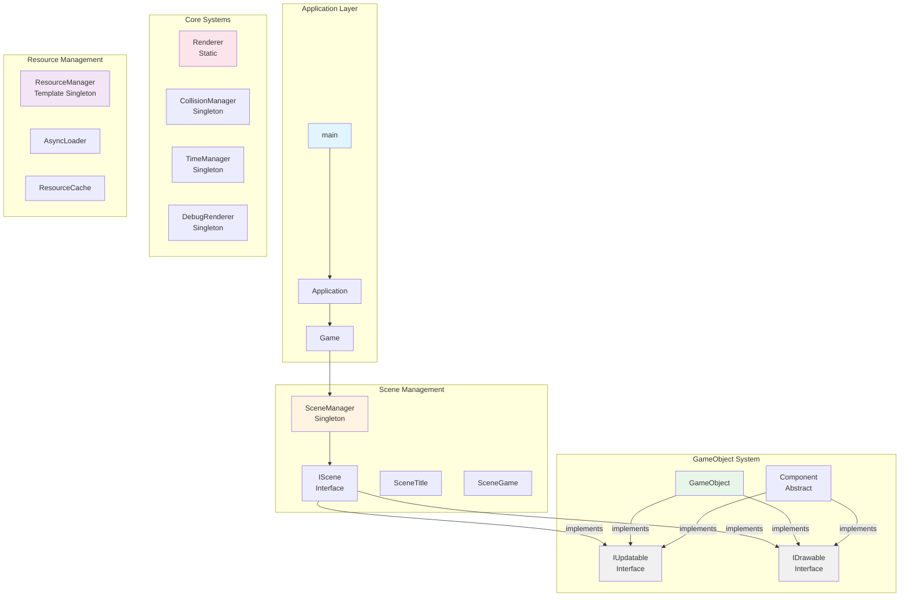
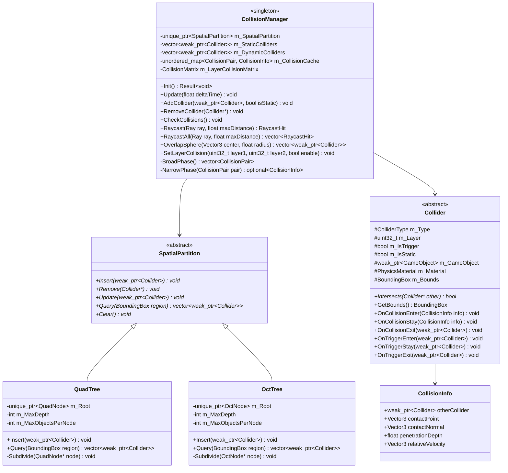
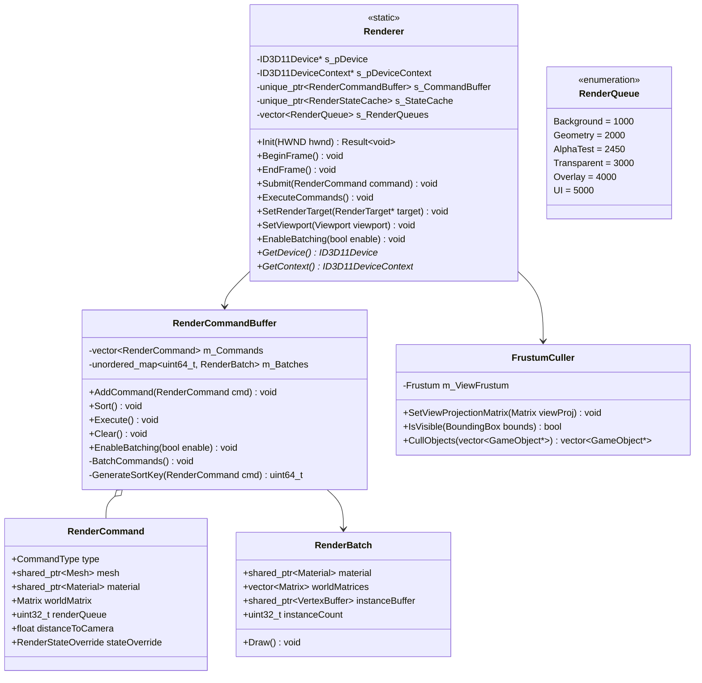
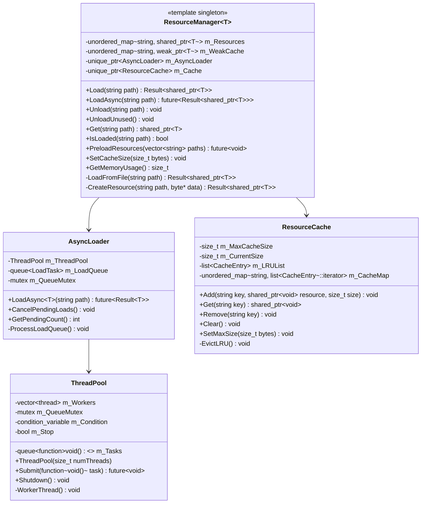
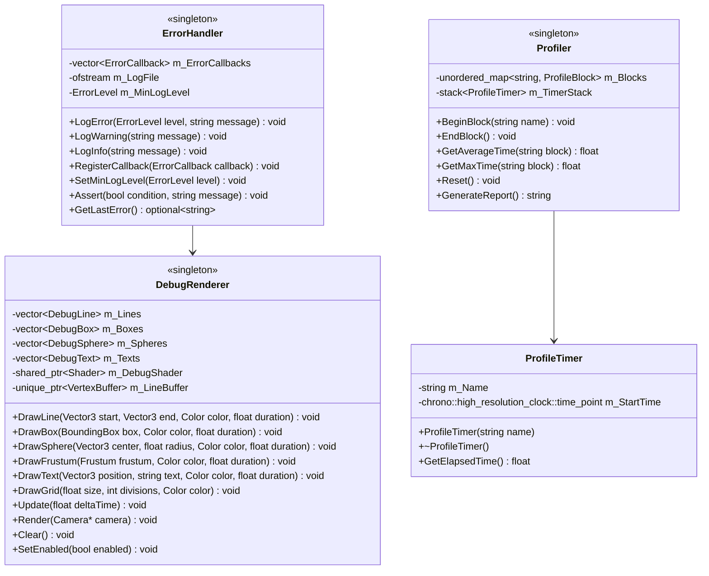
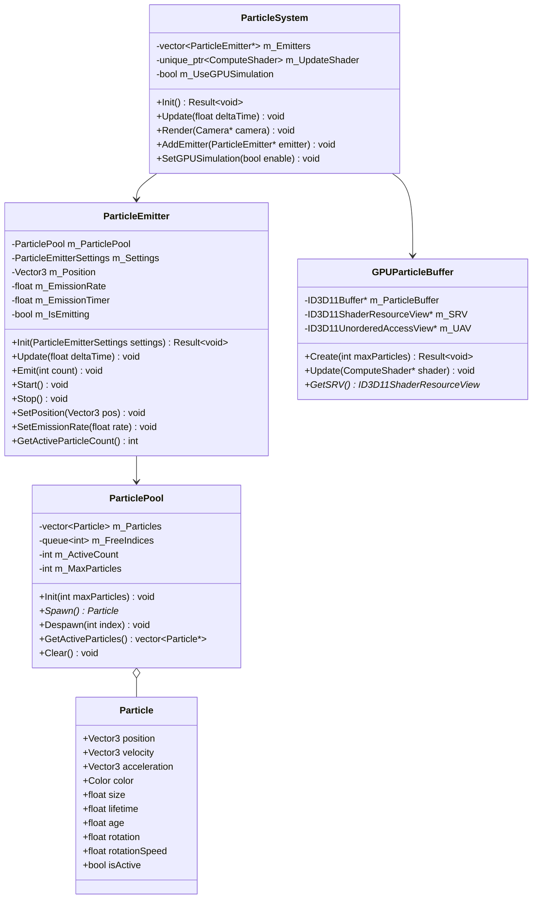
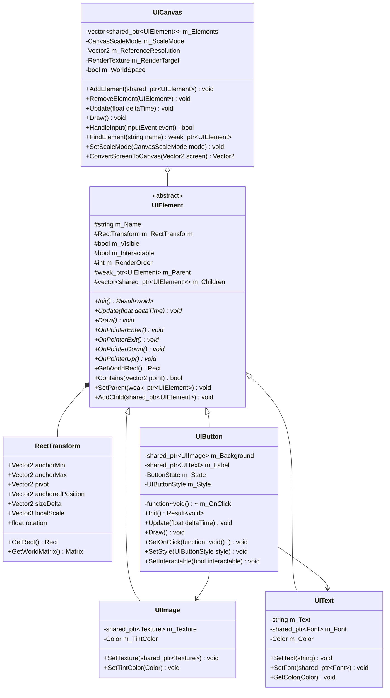
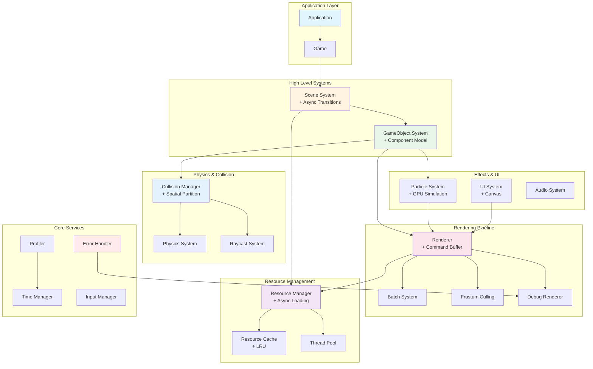

# DirectX ゲームフレームワーク 改善版設計図（修正版）

## 1. 全体アーキテクチャ概要



## 2. コアシステム・インターフェース設計

```mermaid
classDiagram
    class IUpdatable {
        <<interface>>
        +Update(float deltaTime) void*
        +IsActive() bool*
    }
    
    class IDrawable {
        <<interface>>
        +Draw(Camera* camera) void*
        +IsVisible() bool*
        +GetRenderPriority() int*
    }
    
    class IScene {
        <<interface>>
        +Init() Result~void~*
        +Uninit() void*
        +Update(float deltaTime) void*
        +Draw() void*
        +OnEnter() void*
        +OnExit() void*
        +OnPause() void*
        +OnResume() void*
    }
    
    class Result~T~ {
        -optional~T~ m_value
        -string m_error
        +IsSuccess() bool
        +GetValue() T&
        +GetError() string
        +Success(T value) Result~T~$
        +Error(string error) Result~T~$
    }
    
    class Application {
        -HINSTANCE m_hInst
        -HWND m_hWnd
        -uint32_t m_Width
        -uint32_t m_Height
        -unique_ptr~Game~ m_Game
        +Application(width, height)
        +Run() Result~void~
        +GetWindow() HWND
        -InitApp() Result~void~
        -UninitApp() void
        -MainLoop() void
        -WndProc() LRESULT
    }
    
    class Game {
        -unique_ptr~Camera~ m_MainCamera
        -unique_ptr~DebugRenderer~ m_DebugRenderer
        +Init() Result~void~
        +Update(float deltaTime) void
        +Draw() void
        +Uninit() void
        +GetMainCamera() Camera*
    }
    
    Application --> Game
    Application --> Result : uses
    Game -->|implements| IUpdatable
    Game -->|implements| IDrawable
```

## 3. メモリ管理統一版 GameObject システム

```mermaid
classDiagram
    class GameObject {
        -string m_Name
        -string m_Tag
        -uint32_t m_Layer
        -bool m_Active
        -unique_ptr~Transform~ m_Transform
        -vector~unique_ptr~Component~~ m_Components
        -weak_ptr~GameObject~ m_Parent
        -vector~shared_ptr~GameObject~~ m_Children
        +Init() Result~void~
        +Uninit() void
        +Update(float deltaTime) void
        +Draw(Camera* camera) void
        +LateUpdate(float deltaTime) void
        +FixedUpdate(float fixedDeltaTime) void
        +AddComponent~T~() Result~T*~
        +GetComponent~T~() T*
        +RemoveComponent~T~() void
        +GetTransform() Transform*
        +SetParent(weak_ptr~GameObject~) void
        +AddChild(shared_ptr~GameObject~) void
        +FindChild(string name) shared_ptr~GameObject~
    }
    
    class Transform {
        -Vector3 m_LocalPosition
        -Quaternion m_LocalRotation
        -Vector3 m_LocalScale
        -Matrix m_WorldMatrix
        -bool m_IsDirty
        +UpdateWorldMatrix() void
        +GetWorldMatrix() Matrix
        +SetLocalPosition(Vector3) void
        +GetWorldPosition() Vector3
        +TransformPoint(Vector3) Vector3
        +InverseTransformPoint(Vector3) Vector3
    }
    
    class Component {
        <<abstract>>
        #weak_ptr~GameObject~ m_Owner
        #bool m_Enabled
        +Init() Result~void~*
        +Uninit() void*
        +Update(float deltaTime) void*
        +LateUpdate(float deltaTime) void*
        +FixedUpdate(float fixedDeltaTime) void*
        +Draw(Camera* camera) void*
        +OnEnable() void*
        +OnDisable() void*
        +GetOwner() GameObject*
        +GetTransform() Transform*
        +SetEnabled(bool) void
        +IsEnabled() bool
    }
    
    class MeshRenderer {
        -shared_ptr~Model~ m_Model
        -shared_ptr~Material~ m_Material
        -bool m_CastShadows
        -bool m_ReceiveShadows
        +Init() Result~void~
        +Draw(Camera* camera) void
        +SetModel(shared_ptr~Model~) void
        +SetMaterial(shared_ptr~Material~) void
        +GetBounds() BoundingBox
    }
    
    GameObject -->|implements| IUpdatable
    GameObject -->|implements| IDrawable
    GameObject *-- Transform
    GameObject o-- Component
    Component -->|implements| IUpdatable
    Component -->|implements| IDrawable
    Component <|-- MeshRenderer
```

## 4. 改善版シーン管理システム

```mermaid
classDiagram
    class SceneManager {
        <<singleton>>
        -unique_ptr~SceneBase~ m_CurrentScene
        -unique_ptr~SceneBase~ m_NextScene
        -unique_ptr~SceneBase~ m_LoadingScene
        -bool m_IsTransitioning
        -float m_TransitionProgress
        -SceneTransition m_TransitionType
        +Init() Result~void~
        +Update(float deltaTime) void
        +Draw() void
        +ChangeScene~T~(SceneTransition type) Result~void~
        +ChangeSceneAsync~T~() future~Result~void~~
        +PushScene~T~() void
        +PopScene() void
        +GetCurrentScene() SceneBase*
        -HandleTransition() void
    }
    
    class SceneBase {
        <<abstract>>
        #bool m_IsInitialized
        #bool m_IsActive
        #bool m_IsPaused
        #vector~shared_ptr~GameObject~~ m_GameObjects
        #vector~shared_ptr~GameObject~~ m_UIObjects
        #unique_ptr~Camera~ m_SceneCamera
        #unique_ptr~UICanvas~ m_UICanvas
        #unordered_map~string, shared_ptr~GameObject~~ m_NamedObjects
        +Init() Result~void~*
        +Uninit() void*
        +Update(float deltaTime) void*
        +Draw() void*
        +OnEnter() void*
        +OnExit() void*
        +OnPause() void*
        +OnResume() void*
        +CreateGameObject(string name) shared_ptr~GameObject~
        +FindGameObject(string name) weak_ptr~GameObject~
        +FindGameObjectsWithTag(string tag) vector~weak_ptr~GameObject~~
        +DestroyGameObject(shared_ptr~GameObject~) void
        +PreloadResources() future~void~*
    }
    
    class SceneTransition {
        <<enumeration>>
        None
        Fade
        Slide
        Zoom
        Custom
    }
    
    SceneManager --> SceneBase
    SceneBase -->|implements| IScene
    SceneManager --> SceneTransition
```

## 5. 最適化版コリジョンシステム



## 6. レンダリング最適化システム



## 7. 非同期リソース管理システム



## 8. エラーハンドリング・デバッグシステム



## 9. 改善版パーティクルシステム



## 10. 改善版UIシステム



## 11. 統合システム依存関係図



## 12. メモリ管理ガイドライン

### 所有権の明確化

| ポインタ型 | 用途 | 使用場面 |
|-----------|------|---------|
| `unique_ptr<T>` | 単一所有権 | Component, Transform, 内部システム |
| `shared_ptr<T>` | 共有所有権 | GameObject, Resource, Model |
| `weak_ptr<T>` | 観察用参照 | Parent参照, キャッシュ, 循環参照回避 |
| `T*` (生ポインタ) | 一時参照 | 関数引数, 戻り値（所有権なし） |

### メモリ管理の実装例

```cpp
class GameObject {
private:
    // Transformは必須コンポーネントとして単一所有
    std::unique_ptr<Transform> m_Transform;
    
    // Componentは単一所有
    std::vector<std::unique_ptr<Component>> m_Components;
    
    // 親への参照は弱参照（循環参照防止）
    std::weak_ptr<GameObject> m_Parent;
    
    // 子は共有所有
    std::vector<std::shared_ptr<GameObject>> m_Children;

public:
    // Transformへのアクセス（所有権は渡さない）
    Transform* GetTransform() { 
        return m_Transform.get(); 
    }
    
    // コンポーネント追加（完全な所有権移譲）
    template<typename T, typename... Args>
    T* AddComponent(Args&&... args) {
        auto component = std::make_unique<T>(std::forward<Args>(args)...);
        T* ptr = component.get();
        m_Components.push_back(std::move(component));
        return ptr;
    }
};
```

## 13. エラーハンドリングパターン

### Result型の実装と使用例

```cpp
// Result型の定義
template<typename T>
class Result {
public:
    static Result<T> Success(T value) {
        Result<T> result;
        result.m_value = std::move(value);
        return result;
    }
    
    static Result<T> Error(std::string error) {
        Result<T> result;
        result.m_error = std::move(error);
        return result;
    }
    
    bool IsSuccess() const { 
        return m_value.has_value(); 
    }
    
    T& GetValue() { 
        return m_value.value(); 
    }
    
    const std::string& GetError() const { 
        return m_error; 
    }
    
private:
    std::optional<T> m_value;
    std::string m_error;
};

// 使用例：モデル読み込み
Result<std::shared_ptr<Model>> LoadModel(const std::string& path) {
    // ファイル存在チェック
    if (!std::filesystem::exists(path)) {
        return Result<std::shared_ptr<Model>>::Error(
            "File not found: " + path
        );
    }
    
    // モデル読み込み
    auto model = std::make_shared<Model>();
    if (!model->Load(path)) {
        return Result<std::shared_ptr<Model>>::Error(
            "Failed to parse model: " + path
        );
    }
    
    return Result<std::shared_ptr<Model>>::Success(model);
}

// 呼び出し側での処理
void InitializeScene() {
    auto result = LoadModel("assets/models/character.fbx");
    
    if (result.IsSuccess()) {
        auto model = result.GetValue();
        // モデルを使用
        m_Character->SetModel(model);
    } else {
        // エラー処理
        ErrorHandler::GetInstance().LogError(
            ErrorLevel::Warning, 
            result.GetError()
        );
        // フォールバック処理
        LoadDefaultModel();
    }
}
```

## 14. パフォーマンス最適化チェックリスト

### レンダリング最適化
- [x] フラスタムカリング実装
- [x] マテリアル/シェーダーごとのバッチング
- [x] インスタンシング対応
- [x] コマンドバッファによる描画最適化
- [ ] LOD（Level of Detail）システム
- [ ] オクルージョンカリング（オプション）

### メモリ最適化
- [x] オブジェクトプール（ParticlePool）
- [x] リソースキャッシュ with LRU
- [x] 弱参照による循環参照防止
- [x] 非同期リソースローディング
- [ ] メモリアロケータのカスタマイズ

### CPU最適化
- [x] 空間分割（QuadTree/OctTree）
- [x] マルチスレッド対応（ThreadPool）
- [x] コンポーネントのアップデート順序最適化
- [x] デルタタイム管理
- [ ] ジョブシステム実装

### GPU最適化
- [x] GPUパーティクルシミュレーション
- [x] Compute Shader活用
- [x] ConstantBuffer最適化
- [x] RenderState キャッシング
- [ ] GPU駆動レンダリング

## 15. 実装優先順位とロードマップ

### Phase 1: 基盤構築（1-2週間）
必須の基礎システムを実装

1. **Result型とエラーハンドリング** 
   - エラー処理の統一化
   - ログシステムの構築

2. **メモリ管理の統一**
   - smart pointerの導入
   - 所有権ルールの確立

3. **基本GameObject/Componentシステム**
   - Transform実装
   - Component基底クラス

4. **シンプルなレンダラー**
   - 基本的な描画機能
   - シェーダー管理

### Phase 2: コア機能（2-3週間）
ゲーム開発に必要な主要機能

5. **シーン管理システム**
   - シーン遷移
   - GameObject管理

6. **リソースマネージャー（同期版）**
   - テクスチャ/モデル読み込み
   - キャッシュシステム

7. **基本的なコリジョンシステム**
   - AABB/Sphere判定
   - コリジョンイベント

8. **入力管理**
   - キーボード/マウス
   - ゲームパッド対応

### Phase 3: 最適化（2-3週間）
パフォーマンス向上施策

9. **レンダリングコマンドバッファ**
   - 描画コマンドのキューイング
   - ソート最適化

10. **空間分割（QuadTree/OctTree）**
    - 効率的な衝突判定
    - カリング最適化

11. **非同期リソースローディング**
    - ThreadPool実装
    - プログレス表示

12. **バッチングシステム**
    - インスタンシング
    - マテリアルバッチング

### Phase 4: 高度な機能（3-4週間）
追加の便利機能

13. **GPUパーティクル**
    - Compute Shader実装
    - 大量パーティクル対応

14. **高度なUIシステム**
    - レイアウトシステム
    - イベントシステム

15. **プロファイラー**
    - パフォーマンス計測
    - ボトルネック特定

16. **デバッグレンダラー**
    - デバッグ表示
    - ギズモ描画

## 実装のベストプラクティス

### コーディング規約
```cpp
// ファイル名: PascalCase.h/.cpp
// クラス名: PascalCase
// 関数名: PascalCase
// 変数名: m_camelCase (メンバ変数)
//        camelCase (ローカル変数)
// 定数: UPPER_SNAKE_CASE
// 名前空間: lower_snake_case

// ヘッダーガード
#pragma once

// 前方宣言を活用
class GameObject;

// インクルードは最小限に
#include <memory>
#include <vector>
```

### デバッグマクロ
```cpp
#ifdef _DEBUG
    #define ASSERT(condition, message) \
        if (!(condition)) { \
            ErrorHandler::GetInstance().Assert(false, message); \
        }
    
    #define LOG(message) \
        ErrorHandler::GetInstance().LogInfo(message)
#else
    #define ASSERT(condition, message)
    #define LOG(message)
#endif
```

このフレームワーク設計により、堅牢で拡張性が高く、パフォーマンスも考慮されたゲームエンジンの構築が可能になります。
